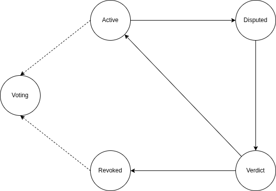
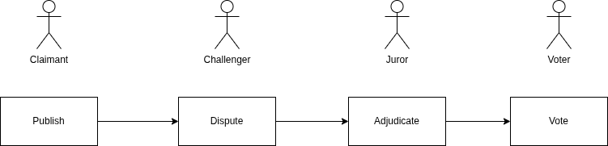

Phân vai trò của các tác tử.

Một người dùng bình thường có thể tiến hóa vai trò.

Điểm của voter khi vote ở đúng trung vị thấp hơn điểm danh tiếng khi publish khoảng 20 lần khi ở V_min và 50 lần khi ở V_max.

Điểm danh tiếng nhận được và mất đi của publish và challenge là như nhau.

Số lượng người đủ điều kiện làm juror sẽ tương đương với 20% người có điểm danh tiếng cao nhất.

Điểm voter đánh giá trọng tài sẽ bằng điểm danh tiếng nhân cho điểm đánh giá trọng tài.

Điểm voter nhận về sau khi đánh giá trọng tài sẽ là phân phối hình quả chuông dựa theo trung vị.

Một Claim sẽ có các statemachine như sau, trong đó Voting chỉ xảy ra sau khi đã có phán quyết (verdict):

Một chuỗi các hành động sẽ tương ứng với các hành động như sau:

