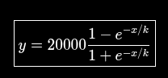
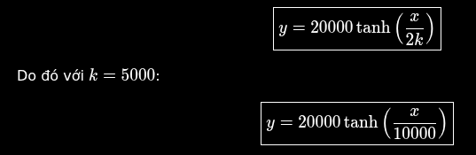

## Khoảng điểm đặt Bond:
2000 <= B <= 5000

## Mức trần khi đặt sigmoid
-20000 <= Sum(F(B)) <= 20000

## Công thức quy đổi Bond ra danh tiếng sẽ dùng hàm tuyến tính:
R = F(B) = B

## Để mô phỏng schelling point, ta dùng hàm trị tuyệt đối:
Giả sử ta có miền chạy trong khoảng từ -s <= x <= s Lúc này thì ta có 40% âm và 60% dương khi tính tích phân.

