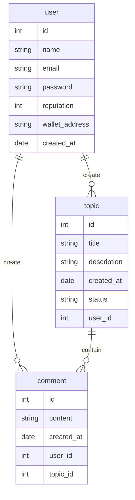

```mermaid
erDiagram

  user ||--o{ topic : create

  user ||--o{ comment : create

  topic ||--o{ comment : contain

  user {
    int id  
    string name
    string email
    string password
    int reputation
    string wallet_address
    date created_at 
  }

  topic {
    int id 
    string title 
    string description 
    date created_at 
    string status 
    int user_id
  }

  comment {
    int id 
    string content
    date created_at 
    int user_id
    int topic_id
  }
```
