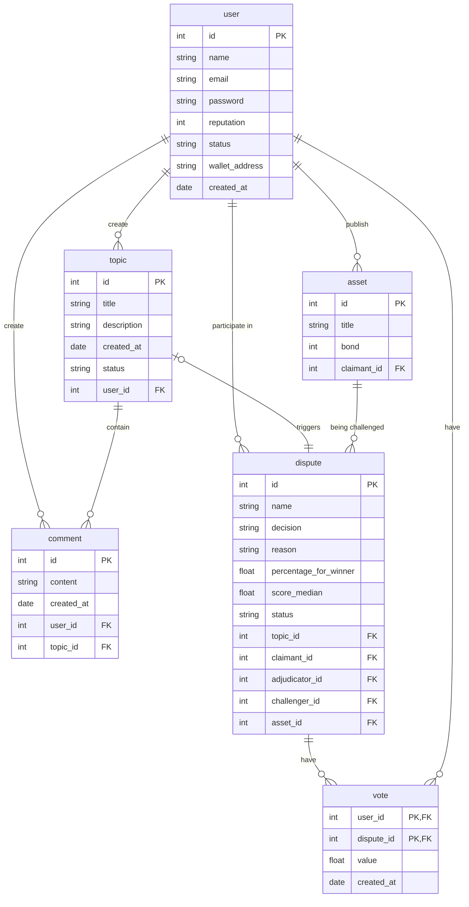

```mermaid
erDiagram
    user ||--o{ topic : create
    user ||--o{ comment : create
    topic ||--o{ comment : contain
    user ||--o{ dispute : "participate in"
    topic |o--|| dispute : triggers
    dispute ||--o{ vote : have
    user ||--o{ vote : have
    asset ||--o{ dispute : "being challenged"
    user ||--o{ asset : publish

    user {
        int id PK
        string name
        string email
        string password
        int reputation
        string status
        string wallet_address
        date created_at
    }

    topic {
        int id PK
        string title
        string description
        date created_at
        string status
        int user_id FK
    }

    comment {
        int id PK
        string content
        date created_at
        int user_id FK
        int topic_id FK
    }

    asset {
        int id PK
        string title
        int bond
        int claimant_id FK
    }

    dispute {
        int id PK
        string name
        string decision
        string reason
        float percentage_for_winner
        float score_median
        string status
        int topic_id FK
        int claimant_id FK
        int adjudicator_id FK
        int challenger_id FK
        int asset_id FK
    }

    vote {
        int user_id "PK,FK"
        int dispute_id "PK,FK"
        float value
        date created_at
    }
```
