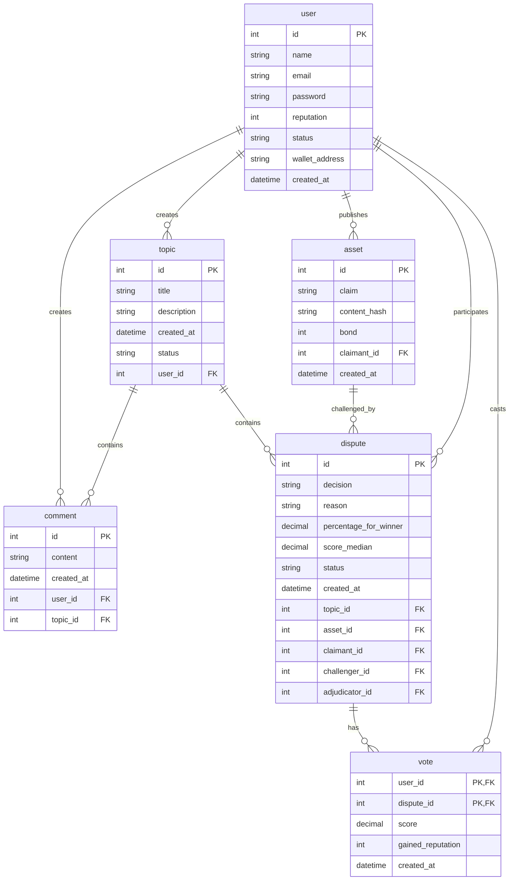

```mermaid
erDiagram
    user ||--o{ topic : creates
    user ||--o{ comment : creates
    user ||--o{ asset : publishes

    topic ||--o{ comment : contains
    topic ||--o{ dispute : contains

    asset ||--o{ dispute : challenged_by

    user ||--o{ dispute : participates
    dispute ||--o{ vote : has
    user ||--o{ vote : casts

    user {
        int id PK
        string name
        string email
        string password
        int reputation
        string status
        string wallet_address
        datetime created_at
    }

    topic {
        int id PK
        string title
        string description
        datetime created_at
        string status
        int user_id FK
    }

    comment {
        int id PK
        string content
        datetime created_at
        int user_id FK
        int topic_id FK
    }

    asset {
        int id PK
        string claim
        string content_hash
        int bond
        int claimant_id FK
        datetime created_at
    }

    dispute {
        int id PK
        string decision
        string reason
        decimal percentage_for_winner
        decimal score_median
        string status
        datetime created_at
        int topic_id FK
        int asset_id FK
        int claimant_id FK
        int challenger_id FK
        int adjudicator_id FK
    }

    vote {
        int user_id PK,FK
        int dispute_id PK,FK
        decimal score
        int gained_reputation
        datetime created_at
    }
```
